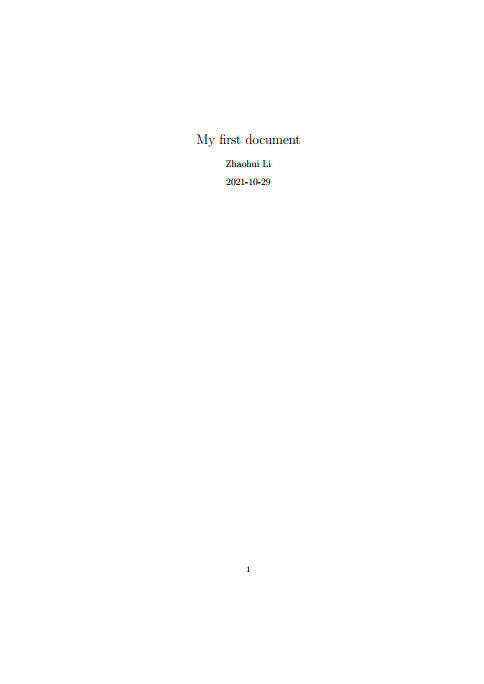

# <center>第一个LaTeX文档</center>

这篇文章展示如何创建基本LaTeX文档和标题页，介绍基本的文件布局。

[TOC]

### 1.基本布局
利用LaTeX创建文档是简单且有趣的。相比于Word，你只需要一个包含了LaTeX代码和实际内容（比如，文章文字）的纯文本文件(*.tex文件)。LaTeX使用控制语句来定义你的内容该如何格式化。LaTeX编译器将会把你的.tex文件编译成一个.pdf文件，而这就是你最终得到的结果。一个基本的LaTeX文档可以用下面的代码创建：
```latex
\documentclass{article}
\begin{document}
    Hello World!
\end{document}
```
一旦你把上述代码编译成pdf文档，你将会看到如下的文本内容：
>Hello World!

在pdf文档底部有页码，这是用`article`类自动生成的。

让我们仔细看看这个神奇现象是如何发生。正如你所看到的，你会在上面的代码示例中找到一些以反斜杠`\`开头的语句。这告诉LaTeX这不是文章的实际文本内容，而是LaTeX编译器的指令或命令。所有的命令具有相同的结构`commandname{option}`。第一部分指示命令的名称，大括号内的`option`为设置该命令的选项。选项内容因命令而异，稍后会在本教程中学习其中的一些。

大多数时候，这些命令含义可以根据名称可知：`\documentclass{article}`，你甚至不需要记所有这些命令，因为在后续写作中你可以直接复制并粘贴这些命令。该命令中命令名称为`documentclass`，并且设置了文档类（到文章）。

LaTeX使用文档类来影响文档的整体布局。例如，有一个用于排版文章(`article`)的类，一个用于排版书籍(`book`)的类等等。在本教程中，我将始终使用`article`类。

第二个示例与第一个示例略有不同，命令涉及`\begin`和`\end`语句。实际上这不是命令，而是定义了环境。环境只是文档中应用某些排版规则的区域。在一个文档中有多个环境是可能的并且是通常是必要的。但是`document environment`是最顶层的环境，以下代码显示了如何使用环境：
```latex
% 有效语句
\begin{document}
    \begin{environment1}
        \begin{environment2}
        \end{environment2}
    \end{environment1}
\end{document}

% 无效语句1
\begin{document}
    \begin{environment1}
        \begin{environment2}
    \end{environment1}
        \end{environment2}
\end{document}
% 无效语句2
\begin{document}
    \begin{environment1}
\end{document}
    \end{environment1}
% 无效语句3
\begin{environment1}
    \begin{document}
    \end{document}
\end{environment1}
```

### 2.标题页
有许多环境变量选择，你将非常可能在你需要插入大量数学公式或者图表到文档中时使用它们。尽管定义你自己的环境是可以的，但是非常可能你想要的环境已经存在了。LaTeX已经给出了一些预定义的环境，并且在扩展包(`packages`)中甚至有更多已定义的环境，我们将在后续一节课程中单独介绍。

让我们尝试一些新的命令来使我们的文档更加有趣：
```latex
\documentclass{article}

\title{My first document}
\date{2021-10-29}
\author{Zhaohui Li}

\begin{document}
    \maketitle
    \newpage

    Hello World!
\end{document}
```



明显地，命令`\title`,`\date`,`\author`不在`document`环境中，因此，他们不会在我们的文档中直接显示。在我们的主文档之前的内容被称为前言`preamble`。在上面的例子中，我们用它来设置命令`\maketitle`的参数值，这个命令将自动创建一个标题页（titlepage）。`\newpage`命令表示新建一个空白页。

如果我们编译上述例子，我们将会看到一个格式化的标题页，但是在标题页底部有一个页码。如果我们不想要在标题页显示页码，我们可以通过告诉LaTeX隐藏标题页的页码的方式将它移除。通过在标题页添加命令`\pagenumbering{gobble}`，然后在下一页改回成`\pagenumbering{arabic}`：
```latex
\documentclass{article}

\title{My first document}
\date{2021-10-29}
\author{Zhaohui Li}

\begin{document}
    \pagenumbering{gobble}
    \maketitle
    \newpage
    \pagenumbering{arabic}

    Hello World!
\end{document}
```


就是这样，你已经成功创建你的第一个LaTeX文档。后续课程将继续使用LaTeX的许多功能。