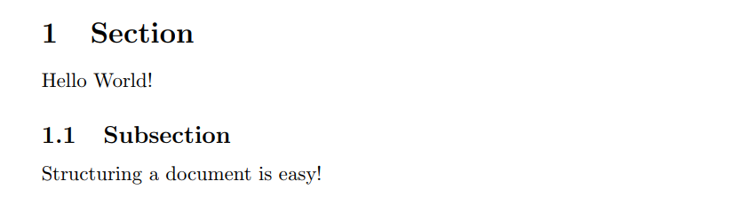
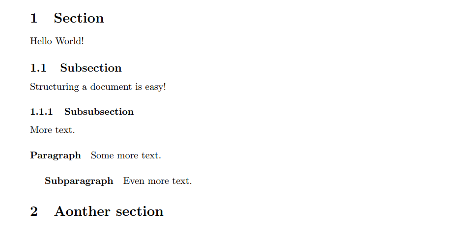

# <center>文档结构——章节与段落</center>

学习如何在LaTeX中使用章节（sections）和段落（paragraphs）来结构化你的文档。

[TOC]

### 1.章节元素（章节，子章节和段落等）
在上节课我们已经创建了一个非常基本的文档，但是当我们写论文时，把论文内容结构化成多个逻辑单元时必要的。为了实现这个功能，LaTeX为我们提供了生成章节标题并自动编号的命令。创建章节标题的命令很简单：

```latex
\section{}
\subsection{}
\subsubsection{}

\paragraph{}
\subparagraph{}
```

### 2.章节与子章节示例
章节（`section`）命令是自动编号的，并且将会出现在文档目录中。段落（`Paragraphs`）不编号，并且不在文档目录中，例子如下：

```latex
\documentclass{article}

\title{My first document}
\date{2021-10-29}
\author{Zhaohui Li}

\begin{document}
    \pagenumbering{gobble}
    \maketitle
    \newpage
    \pagenumbering{arabic}

    \section{Section}
    Hello World!
    \subsection{Subsection}
    Structuring a document is easy!

\end{document}
```
结果如下：


<!-- <font face='Times New Roman' color = 'k' size = 5>1 Section</font>
<font face='Times New Roman'>Hello World!</font>
<font face='Times New Roman' color = 'k' size = 4>1.1 Subsection</font>
<font face='Times New Roman'>Structuring a document is easy!</font> -->

### 3.章节元素层级结构
章节和段落层级结构示例如下：
```latex
\documentclass{article}

\title{My first document}
\date{2021-10-29}
\author{Zhaohui Li}

\begin{document}
    \pagenumbering{gobble}
    \maketitle
    \newpage
    \pagenumbering{arabic}

    \section{Section}
    Hello World!
    \subsection{Subsection}
    Structuring a document is easy!
    \subsubsection{Subsubsection}
    More text.
    \paragraph{Paragraph}
    Some more text.
    \subparagraph{Subparagraph}
    Even more text.
    \section{Aonther section}

\end{document}
```
结果如下：


使用LaTeX将文档组织成多个章节非常容易。Word中也有这个功能，但是大多数人没有正确使用它。在LaTeX中，在整个论文中保持一致的格式是非常容易的。在下一节中，我将简要介绍扩展包（`packages`）并展示一些基本的数学排版。这是LaTeX真正擅长的地方。

### 4.总结
- LaTeX使用命令`\section`,`\subsection`和`\subsubsection`来定义文档的章节(`sections`)
- 章节(`sections`)具有连续编号，并且出现在目录中
- 段落(`paragraphs`)不具有编号，因此不出现在目录中