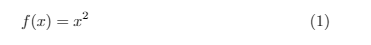
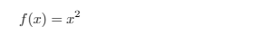

# <center>扩展包</center>

在LaTeX中使用扩展包来增加更多的功能。amsmath包和基本数学排版演示。

[TOC]

默认情况下，LaTeX提供了许多功能，但在某些情况下，使用扩展包会很方便。要在LaTeX中导入扩展包，只需要将`\usepackage`命令添加到文档的序言( *`preamble`* )中
```latex
\documentclass{article}

\usepackage{PACKAGENAME}

\begin{document}
...
\end{document}
```
### 1.安装扩展包
当使用Linux或Mac时，大部分扩展包默认已安装，因此通常无需另外安装。对于Ubuntu,从包管理器中安装 *`textlive-full`* 后，将会提供所有可用的扩展包。对于Windows中的MiKTeX捆绑包，如果将它导入到文档中，它将会下载改包。

### 2.扩展包的用途
有无数的扩展包，他们用于不同的目的，在我的教程中我将解释一些最有用的。为了排版数学公式，LaTeX提供了一个叫做 *`equation`* 的环境。此环境中所有的内容都将以数学模式打印，这是一种特殊的数学排版环境。LaTeX还为我们处理方程中的数字：
```latex
\documentclass{article}
\begin{document}

\begin{equation}
    f(x) = x^2
\end{equation}

\end{document}
```
结果如下：



### 3.使用\导入扩展包
自动编号是一个有用的功能，但有时需要删除它们以进行辅助计算。默认情况下，LaTeX不允许这样做，现在我们要导入一个可以这样操作的包：
```latex
\documentclass{article}

\usepackage{amsmath}

\begin{document}

\begin{equation*}
    f(x) = x^2
\end{equation*}

\end{document}
```
现在，得到的结果与之前相同，只有编号被删除了：


### 3.总结
- 扩展包(`packages`)对LaTeX添加了新功能
- 所有扩展包必须包含在序言( *`preamble`* )中
- 扩展包添加了支持图片、链接和目录等功能