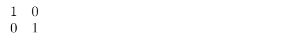

# <center>LaTeX数学与方程</center>

学习在LaTeX中如何排版和对齐方程、矩阵和分数。基本数学功能概述，带有实时渲染。

[TOC]

在LaTeX中有两种主要的数学公式排版模式，一种是通过将公式封装在美元符号 **$** ( *`dollar signs`* )中，然后将其直接嵌入到文本中，另一种是使用预定义的数学环境（`math environment`）。你可以在你的个人电脑或在线平台[overleaf](https://www.overleaf.com/)跟着并尝试以下代码。此外，我也准备了一份[数学符号的快速参考](https://latex-tutorial.com/symbols/math-symbols/)。

### 1.行中数学公式
在同一行文本中嵌入数学符号或公式，只需要将其用 **$** 括起来：
```latex
This formula $f(x) = x^2$ is an example.
```
结果如下：

<font face = "Times New Roman">This formula $f(x) = x^2$ is an example.</font>

### 2.方程和对齐
最有用的数学环境(`math environment`)是用于排版单个方程的方程环境（`equation environment`）和用于多个方程和自动对齐的对齐环境（`align environment`）：
```latex
\documentclass{article}
\usepackage{amsmath}

\begin{document}

\begin{equation*}
1+2 = 3
\end{equation*}

\begin{equation*}
1 = 3 - 2
\end{equation*}

\begin{align*}
1+2 &= 3\\
1 &= 3 - 2
\end{align*}

\end{document}
```
结果如下：


对齐环境将会在 **&** 符号处对齐方程。单个方程必须用换行符 **\ \\** 分隔。使用方程环境时没有对齐，且不能在方程环境中输入两个方程，否则将导致编译错误。*号（比如，equation\*）仅表示不对等式进行编号。

### 3.指数、分数和积分
LaTeX能够显示任何数学符号，可以排版积分、分数等。每个符号都有特定的语法可供使用。我将演示一些最常见的LaTeX数学表示：
```latex
\documentclass{article}
\usepackage{amsmath}
\begin{document}

\begin{align*}
f(x) &= x^2\\
g(x) &= \frac{1}{x}\\
F(x) &= \int^a_b \frac{1}{3}x^3
\end{align*}

\end{document}
```
结果如下：

也可以结合各种各样命令来创建更加复杂的表达式，例如：
```latex
\frac{1}{\sqrt{x}}
```
结果为：
$\frac{1}{\sqrt{x}}$

表达式越复杂，越容易出错，注意打开和关闭大括号 {} 很重要。 调试此类错误可能需要很长时间。 Lyx 程序提供了一个很棒的公式编辑器，可以稍微简化这项工作。 就个人而言，我手动编写所有代码，因为它比使用公式编辑器更快。

### 4.矩阵
LaTeX中有特定的矩阵环境（`matrix environment`）来显示矩阵，但是**需要在数学环境**中使用。

```latex
\begin{matrix}
1 & 0\\
0 & 1
\end{matrix}
```


### 5.括号、方括号等的缩放
为了将矩阵用方括号括起来，需要使用特殊语句，因为普通的[]符号不会随着矩阵的增长而缩放。以下代码展示错误的矩阵括号使用：

```latex
[
\begin{matrix}
1 & 0\\
0 & 1
\end{matrix}
]
```


正确示例：
```latex
\left[
\begin{matrix}
1 & 0\\
0 & 1
\end{matrix}
\right]
```


这也适用于括号和大括号，并且不限于矩阵。它也可以用于缩放分数和其他表达式：
```latex
\left(\frac{1}{\sqrt{x}}\right)
```
结果为：
$\left(\frac{1}{\sqrt{x}}\right)$

### 6. 总结
- LaTeX是数学排版的强有力工具
- 同行文字中嵌入数学公式使用符号 **$**
- **方程环境** 中能用于一个数学式子
- **对齐环境** 中，在符号 **&** 处对齐
- 单个式子换行使用双斜杠 **\ \\**
- **矩阵环境** 用于矩阵排版
- 括号使用 `\left(\right)` 自动缩放
- 所有数学表达式用唯一的语法符号表示为唯一的命令
- 值得注意的例子：
  - 积分：`\int^a_b` -> $\int^a_b$
  - 分数：`\frac{u}{v}` -> $\frac{u}{v}$
  - 平方根：`\sqrt{x}` -> $\sqrt{x}$
- 希腊字母表以及其他数学符号的字符([参考](https://latex-tutorial.com/symbols/math-symbols/))，例如 `\lambda` 表示 $\lambda$