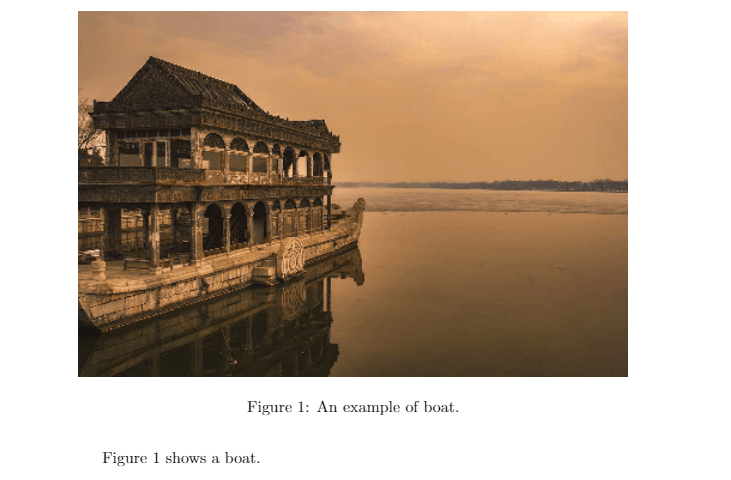
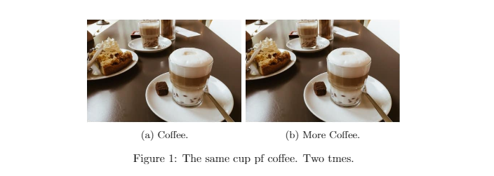
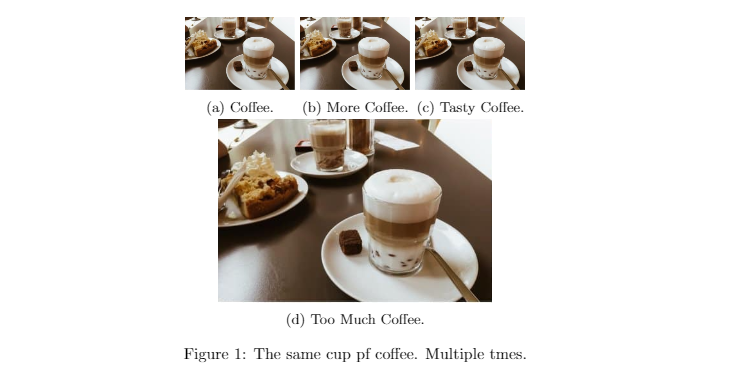

# <center>LaTeX中添加图形</center>

学习在LaTeX中如何插入图形并添加图注。展示使用subfigure环境来插入单个图形和彼此相邻的多个图形。

[TOC]

### 1. LaTeX中的带标题的图形
*`figure`* 环境负责文档中图形的编号和定位。为了插入图形，必须使用`\includegraphics`命令，`[]` 中为可选参数：如您可见，我将`\linewidth`放入到方括号中，表示图片将被缩放到以适合文档的宽度，结果是较小图片将会放大，较大图片将会放小。`{}` 中为图像文件的路径：与文档路径相同则直接 `radiance.png`, 在文件夹下则`figures/radiance.png`。

`\caption`命令为题注,它是图片下方显示的文本。`\label`命令是一个不可见标签，用来设置图片的指代，从而在正文中**引用**。`\ref`命令用来在正文中引用图片标签。

必须包含`graphicx`包才能使用此代码。


```latex
\documentclass{article}

\usepackage{graphicx}

\begin{document}

\begin{figure}
    \includegraphics[width=\linewidth]{./figures/boat.png}
    \caption{An example of boat.}
    \label{fig:radi_1}
\end{figure}

Figure \ref{fig:radi_1} shows a boat.

\end{document}
```
上述代码将会创建如下pdf:


### 2. 图形定位/设置
在某些时候，你会发现当您将代码放入.tex文件中时，它不一定显示在正确的位置。如果您的文档包含大量文本，LaTeX则可能会将图片放在下一页或找的足够空间的任何其他页面。为了避免出现这种情况，有必要为`figure`环境设置浮点值(*`float`* value)。
```latex
\begin{figure}[h!]
```
通过在`figure`环境开始标签`\begin`后添加 *`[h!]`* 来设置浮动将强制图形显示在文档中的位置。可能的值有：
- h(here) - same location（与.tex文件中位置一致）
- t(top) - top of page（页顶）
- b(bottom) - bottom of page（页底）
- p(page) - on an extra page（另起一页？）
- !(override) - will force the specified location（强制放在特定位置）

目前，我只使用过 `[h!]`选项。浮点值包`float package`（`\usepackage{float}`）允许使用选项 `[H]`实现相同功能，甚至比 `[h!]`还严格。

### 3. LaTeX的多图/子图
有时在编写文档时，添加单个推向并不是最佳选择，尤其是当作者需要比较多个结果或图表时。在这种情况下，需要使用不同的环境，即`subfigure`。`subfigure`环境允许将多个图像并排放置在某个位置，使用方法非常简单。

首先需要添加`subcaption`包到序言中：
```latex
\documentclass{article}

\usepackage{graphicx}
\usepackage{subcaption}

\begin{document}
%...
\end{document}
```
然后，需要在`figure`环境中添加多个`subfigure`环境：
```latex
\documentclass{article}

\usepackage{graphicx}
\usepackage{subcaption}

\begin{document}

\begin{figure}[h!]
    \centering
    \begin{subfigure}[b]{0.4\linewidth}
        \includegraphics[width=\linewidth]{figures/coffee.png}
        \caption{Coffee.}
        \label{fig:first}
    \end{subfigure}
    \begin{subfigure}[b]{0.4\linewidth}
        \includegraphics[width=\linewidth]{figures/coffee.png}
        \caption{More Coffee.}
        \label{fig:second}
    \end{subfigure}
    \caption{The same cup pf coffee. Two tmes.}
    \label{fig:coffee}

\end{figure}

\end{document}
```
结果如下：


如果你仔细看，你将会发现我手动设置了图像宽度，宽度为0.4的两张图片填满了整个页面：
```latex
\begin{subfigure}[b]{0.4\linewidth}
```
宽度值设置应该比预期小0.1。如果要将三个图像彼此对齐，则应连续添加三个子图，每个子图的宽度为`0.2\linewidth`。我建议，如果您需要其他图像排版，只需要调整宽度因子，知道您对结果满意为止。具有多行和多列的更详细示例如下：
```latex
\documentclass{article}

\usepackage{graphicx}
\usepackage{subcaption}

\begin{document}

\begin{figure}[h!]
    \centering
    \begin{subfigure}[b]{0.2\linewidth}
        \includegraphics[width=\linewidth]{figures/coffee.png}
        \caption{Coffee.}
        \label{fig:f1}
    \end{subfigure}
    \begin{subfigure}[b]{0.2\linewidth}
        \includegraphics[width=\linewidth]{figure/coffee.png}
        \caption{More Coffee.}
        \label{fig:f2}
    \end{subfigure}
    \begin{subfigure}[b]{0.2\linewidth}
        \includegraphics[width=\linewidth]{figures/coffee.png}
        \caption{Tasty Coffee.}
        \label{fig:f3}
    \end{subfigure}
    \begin{subfigure}[b]{0.5\linewidth}
        \includegraphics[width=\linewidth]{figures/coffee.png}
        \caption{Too Much Coffee.}
        \label{fig:f4}
    \end{subfigure}
    \caption{The same cup pf coffee. Multiple tmes.}
    \label{fig:coffee_4}

\end{figure}

\end{document}
```
结果如下：


如果想了解更多关于subfigures内容，参考[subfigure完全指南](https://latex-tutorial.com/subfigure-latex/)

### 4. 总结
- 使用`graphicx`包和`figure`环境来嵌入图片
- 图片会被自动编号
- 使用`\includegraphics[width=\linewidth]{}`来改变图片宽度
- 使用`\label`设置图片标签并用`\ref`引用标签，实现在正文中引用图片
- 设置如`[h!]`等浮点值选项来设置图片在文档中位置
- 使用`subcaption`包和`subfigure`环境来嵌入多个图片