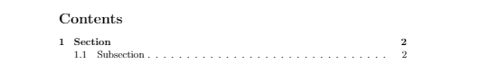
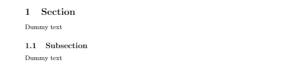
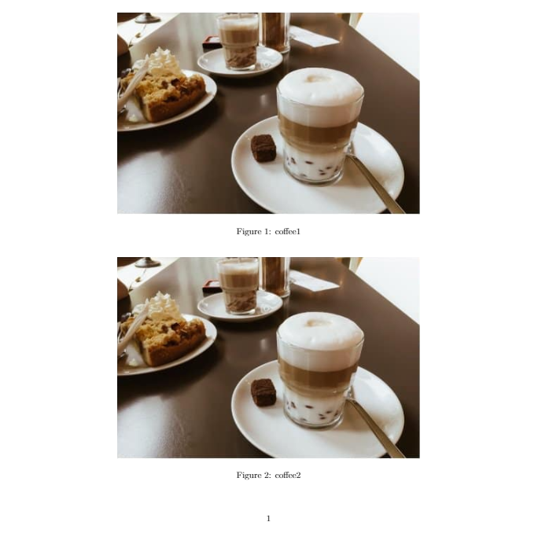
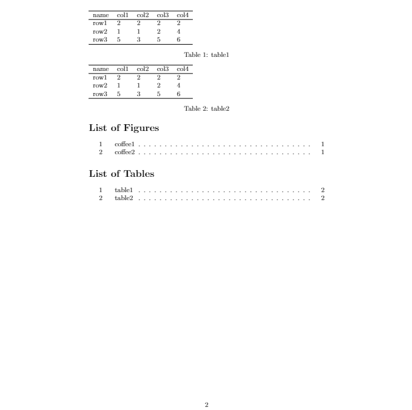
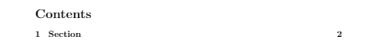
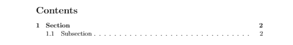
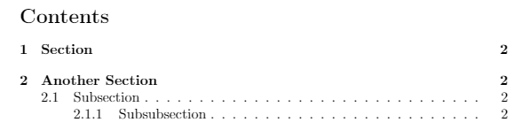
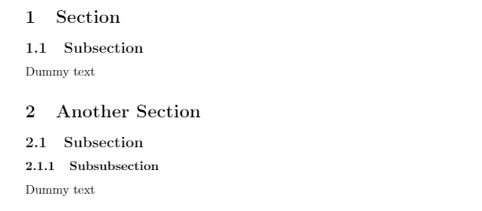

# <center>LaTeX中生成目录</center>

LaTeX提供了自动生成目录、图片列表和表格列表的功能，

[TOC]

### 1. 目录
使用一些简单命令就可以生成目录。LaTeX将会使用章节标题来创建目录，同时也有创建图片列表和表格列表的命令。生成目录命令`\tableofcontents`示例如下：
```latex
\documentclass{article}

\begin{document}

\tableofcontents
\newpage

\section{Section}
Dummy text
\subsection{Subsection}
Dummy text

\end{document}
```
结果如下：
目录：

正文：


### 2. 图/表列表
类似地，生成图片和表格列表命令分别是
```latex
\documentclass{article}
\usepackage{graphicx}

\begin{document}

\begin{figure}[h!]
    \includegraphics[width=\linewidth]{figures/coffee.png}
    \caption{coffee1}
\end{figure}
\begin{figure}[h!]
    \includegraphics[width=\linewidth]{figures/coffee.png}
    \caption{coffee2}
\end{figure}

\begin{table}[h!]
    \begin{tabular}{lllll}
    \hline
    name & col1 & col2 & col3 & col4 \\ \hline
    row1 & 2    & 2    & 2    & 2    \\
    row2 & 1    & 1    & 2    & 4    \\
    row3 & 5    & 3    & 5    & 6    \\ \hline
    \end{tabular}
    \caption{table1}
\end{table}
\begin{table}[h!]
    \begin{tabular}{lllll}
    \hline
    name & col1 & col2 & col3 & col4 \\ \hline
    row1 & 2    & 2    & 2    & 2    \\
    row2 & 1    & 1    & 2    & 4    \\
    row3 & 5    & 3    & 5    & 6    \\ \hline
    \end{tabular}
    \caption{table2}
\end{table}

\begin{appendix}
    \listoffigures
    \listoftables
\end{appendix}

\end{document}
```
结果如下：



### 3. 目录深度
有时需要只显示部分章节标题或特定章节标题，为此可以使用命令`\setcounter{tocdepth}{X}`来设置需要在目录中显示的章节标题深度，其中X表示深度。X为0表示目录不显示任何内容，值为5表示即使是分段也会显示在目录中。该值必须在文档序言中设置并自动应用于整个文档。
```latex
\documentclass{article}

\setcounter{tocdepth}{1} %show sections
%\setcounter{tocdepth}{2} % + subsections
%\setcounter{tocdepth}{3} % + subsubsections
%\setcounter{tocdepth}{4} % + paragraphs
%\setcounter{tocdepth}{5} % + subparagraphs

\begin{document}

\tableofcontents
\newpage

\section{Section}
Dummy text
\subsection{Subsection}
Dummy text

\end{document}
```
结果如下：

增大X值>=2,则结果如下：


如果不想应用于整个文档，只需要单独调整每个章节标题的`tocdepth`。在这种情况下，不需要再序言中设置全局深度。
```latex
\documentclass{article}

\begin{document}

\tableofcontents % default depth {3}
\newpage

\addtocontents{toc}{\setcounter{tocdepth}{1}} % set depth to {1}
\section{Section} 
  \subsection{Subsection}
Dummy text

\addtocontents{toc}{\setcounter{tocdepth}{3}} % reset to default {3}
\section{Another Section} 
    \subsection{Subsection}
        \subsubsection{Subsubsection}
Dummy text

\end{document}
```
上述代码设置第一章节标题为深度`{1}`，只显示`section`，后面重新改成默认深度`{3}`，显示到`subsubsection`：
目录如下：


正文如下：



### 4. 目录间距
如果你对目录中标题的间距不满意，改变目录（以及文档）间距的最简单的方法是使用`setspace`包。首先将`\usepackage{setspace}`添加到序言中：
```latex
\ducomentclass{article}

\usepackage{setspace}
\begin{document}
...
\end{document}
```
然后，你可以对文档的每个部分设置独立的间距，包括目录。例如：
```latex
\ducomentclass{article}

\usepackage{setspace}

\begin{document}
%...
\doublespaceing
\tableofcontents
\singlespacing
%...
\end{document}
```

```latex
\documentclass{article}
\usepackage{setspace}

\begin{document}

\doublespaceing
\tableofcontents % default depth {3}
\singlespacing
\newpage

\addtocontents{toc}{\setcounter{tocdepth}{1}} % set depth to {1}
\section{Section} 
  \subsection{Subsection}
Dummy text

\addtocontents{toc}{\setcounter{tocdepth}{3}} % reset to default {3}
\section{Another Section} 
    \subsection{Subsection}
        \subsubsection{Subsubsection}
Dummy text

\end{document}
```

### 5. 总结
- 使用`\tableofcontents`自动生成目录
- 使用`\listoffigures`和`\listoftables`创建图表目录
- 编译**两次**查看改变
- 使用`\setcounter{tocdepth}{X}; X = {0,1,2,3,4,5}`全局改变目录显示深度,0表示不显示
- 使用`\addtocontents{toc}{\setcounter{tocdepth}{X}}`来单独改变某个章节标题显示深度