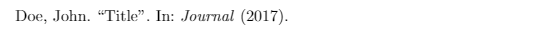

# <center>利用Bibtex/Biblatex在LaTeX中生成参考书目</center>

学习如何利用Bibtex和Bitlatex简单几步创建参考书目，创建参考文献/引文并自动生成脚注。

[TOC]

目前，我们已经了解了许多LaTeX功能并且知道许多内容可由LaTeX自动生成。有添加目录、图片/表格列表，还有几个允许我们生成参考书目的包。我将说明如何使用BibTeX和BibLaTeX(两个都是外部程序,非LaTeX自带)来生成参考书目。首先，我们必须创建一个.bib文件，其中包含了我们的参考书目信息。

### 1. 创建一个.bib文件
.bib文件中包含文档的参考书目信息。由于有许多工具可以自动生成参考书目，因此我只举一个简单例子。我现在将不解释.bib文件本身的结构，因为我建议使用`bibtex`生成器（从google中选一个）。我们的示例将包含一本书，如下所示：
```
@Article{rs9080770,
AUTHOR = {Alonso, Luis and Van Wittenberghe, Shari and Amorós-López, Julia and Vila-Francés, Joan and Gómez-Chova, Luis and Moreno, Jose},
TITLE = {Diurnal Cycle Relationships between Passive Fluorescence, PRI and NPQ of Vegetation in a Controlled Stress Experiment},
JOURNAL = {Remote Sensing},
VOLUME = {9},
YEAR = {2017},
NUMBER = {8},
ARTICLE-NUMBER = {770},
URL = {https://www.mdpi.com/2072-4292/9/8/770},
ISSN = {2072-4292},
ABSTRACT = {In order to estimate vegetation photosynthesis from remote sensing observations; some critical parameters need to be quantified. From all absorbed light; the plant needs to release any excess that is not used for photosynthesis; by non-photochemical quenching; by fluorescence emission and unregulated thermal dissipation. Non-photochemical quenching (NPQ) processes are controlled photoprotective mechanisms which; once activated; strongly control the dynamics of photochemical efficiency. With illumination conditions increasing and decreasing during a diurnal cycle; photoprotection mechanisms needs to change accordingly. The goal of this work is to quantify dynamic NPQ; measured from active fluorescence measurements; based on passive proximal sensing leaf measurements. During a 22-day controlled light and water stress experiment on a tobacco (Nicotiana tabacum L.) leaf we measured the diurnal dynamics of passive fluorescence (Chl F); the Photochemical Reflectance Index (PRI); the Absorbed Photosynthetically Active Radiation (APAR) and leaf temperature in combination with the actively retrieved non-photochemical quenching (NPQ) parameter. Based on a bi-linear combination of diurnal APAR and PRI (plane fit model) we succeeded to estimate NPQ with a RMSE of 0.08. The simple plane fit model estimation represents well the diurnal NPQ dynamics; except for the high light stress phase; when additional reversible photoinhibition processes took place. The present works presents a way of determining NPQ from passive remote sensing measurements; as a necessary step towards estimating photosynthetic rate.},
DOI = {10.3390/rs9080770}
}
```

如果你不想使用BibTeX生成器或类似Citavi的参考文献管理工具（可以自动生成BibTeX文件），你可以在这里找的更多的BibTeX格式示例。

### 2. 使用BibTex
在创建.bib文件之后，我们需要告诉LaTeX在哪里找到我们的参考书目数据库。对于BibTeX，这与打印目录没有太大区别。我们只需要用命令`\bibliography`告诉LaTeX我们的.bib文件的位置并用命令`\bibliographystyle`选择各种书目样式之一。
```latex
\documentclass{article}
\begin{document}
% \cite{XXX}, XXX为.bib文件中AUTHOR上面的字符串
Random citation \cite{rs9080770} embeddeed in text. This is dummy sentence. This is dummy sentence. This is dummy sentence. This is dummy sentence. This is dummy sentence. This is dummy sentence. This is dummy sentence.

\newpage

\bibliography{bibtex/rs}    % .bib文件路径，可以不加.bib后缀
\bibliographystyle{ieeetr}      % style

\end{document}
```
结果如下：
正文：

参考文献：


我将我的.bib文件重命名成rs.bib，并且我也没有加上.bib后缀。对于样式，我选择在我的项目中很常用的`ieeetr`样式，但还有更多样式可用，这将改变我们的参考文献样子。`ieeetr`样式将使用连续数字标记引文，例如本例中的`[1]`。如果我选择样式为`apalike`，我将得到以下结果：
正文：

参考文献：


大多数LaTeX编辑器将会让你选择，在编译时自动运行bibtex。例如，在TeXworks（MiKTeX）中，默认情况下应选择此项。

如果你用其他不同的编辑器，则有必要手动执行bibtex命令。在命令提示符/shell中运行：
```shell
pdflatex test.tex
bibtex rs.bib
pdflatex test.tex
pdflatex test.tex
```
在bibtex命令之前执行pdflatex命令是有必要的，目的是为了告诉bibtex我们论文中引用了什么文献。之后.bib文件将被翻译成正确的输出以供参考部分。接下来的两个步骤将参考部分与我们的LaTeX文档合并，然后在最后一步分配连续编号。

### 3. 使用BibLaTeX自动生成脚注
BibTeX的功能仅限于上述示例中描述的基本样式。有时需要在脚注中引用所有文献，手工维护所有文献可能是一项令人沮丧的任务。此时，BibLaTeX可以很好地解决这个问题。语法与第一个文档略有不同。我们现在必须包含`biblatex`包，并使用`\autocite`和`\printbibliography`命令。将`\bibliography{bibtex/rs}`语句移动到文档的序言中是至关重要的：
```latex
\documentclass{article}

\usepackage[backend=bibtex,style=verbose-trad2]{biblatex}
\bibliography{bibtex/rs.bib}

\begin{document}
% \cite{XXX}, XXX为.bib文件中AUTHOR上面的字符串
Random citation \autocite[1]{rs9080770} embeddeed in text. This is dummy sentence. This is dummy sentence. This is dummy sentence. This is dummy sentence. This is dummy sentence. This is dummy sentence. This is dummy sentence.

\newpage

\printbibliography

\end{document}
```
`\autocite`命令生成脚注，方括号`[1]`中数字表示**页码**，表示在脚注最后显示的数字。

结果如下：


对于BibLaTeX，我们需要在使用`biblatex`包时选择引用样式：
```latex
\usepackage[backend=bibtex, style=verbose-trad2]{biblatex}
```
`backend=bibtex`部分声明使用BibTeX而不是Biber作为我们的后端，因为Biber无法在某些编辑器（如TeXworks）中工作。我花了一段时间才弄清楚如何自动生成脚注，因为我在互联网上找到的资源根本没有提到这个。

### 4. BibTeX格式
这并不意味着是BibTeX格式的完整形式，而是让您了解如何正确引用各种来源。如果您对BibTeX格式的完整形式感兴趣，我建议您查看Wikibooks上的资源([LaTeX/参考文献管理](https://zh.wikibooks.org/wiki/LaTeX/%E5%8F%82%E8%80%83%E6%96%87%E7%8C%AE%E7%AE%A1%E7%90%86))。

#### 4.1 论文Article
```
@ARTICLE{ARTICLE:1,
    AUTHOR="John Doe",
    TITLE="Title",
    JOURNAL="Journal",
    YEAR="2017",
}
```


#### 4.2 图书Book
```
@BOOK{BOOK:1,
    AUTHOR="John Doe",
    TITLE="The Book without Title",
    PUBLISHER="Dummy Publisher",
    YEAR="2100",
}
```


#### 4.3 书的特定页Inbook(specific pages)
```
@INBOOK{BOOK:2,
    AUTHOR="John Doe",
    TITLE="The Book without Title",
    PUBLISHER="Dummy Publisher",
    YEAR="2100",
    PAGES="100-200",
}
```


#### 4.4 网站Website
```
@MISC{WEBSITE:1,
    HOWPUBLISHED = "\url{http://example.com}",
    AUTHOR = "Intel",
    TITLE = "Example Website",
    MONTH = "Dec",
    YEAR = "1988",
    NOTE = "Accessed on 2012-11-11"
}
```


### 5. BibTeX样式
下面是与BibTeX一起使用的一些常用样式的快速概览：
#### 5.1 Abbrv


#### 5.2 Alpha


#### 5.3 Apalike


#### 5.4 IEEEtr


#### 5.5 Plain


我正在尝试使用其他常用样式更新此列表。如果您在这里遗漏了什么，请告诉我。

### 6. 新帖子！从在线数据库导出数目数据库(BibTeX)条目

未更新

### 7. 总结
- 利用BibTeX和BibLaTeX创建参考书目
- 首先使用`\bibliography{BIB_FILE_NAME}`（可以不加.bib后缀）定义.bib文件路径和文件名
- 对于BibTeX，在文档中使用`\bibliography`语句；对于BibLaTeX则在序言中。
- BibTeX使用`\bibliograohystyle`命令来设置引文样式
- BibLaTeX样式设置：`\usepackage[backend=bibtex, style=verbose-trad2]{biblatex}`
- BibTeX使用`\cite`命令，BibLaTeX使用`\autocite`命令
- `\autocite`命令需要设置页码参数：`\autocite[NUM]{}`