# <center>LaTeX表格</center>

学习如何在LaTeX中创建表格，包括多行、多列、多页和横向表格等所有功能。

[TOC]

在本节教程中，我们将学习如何使用`\table`和`\tabular`环境在LaTeX中创建表格。


### 1. 第一个表格/表格模板
LaTeX中的表格可以通过`table`和`tabular`环境的组合来创建。`table`环境部分包含表标题（caption）并定义表格的小数位（float），即表格在文档中的位置以及是否将它居中显示。用于图片展示的`\caption`和`\label`命令使用方法与此相同。表格内容包含在`tabular`环境中。

`tabular`环境使用与号 `&`作为列分隔符，换行符`\\`作为行分隔符。分隔表格列的垂直线`|`作为参数传递给`table`环境(例如，`\begin{tabular}{l|c|r}`),字母表示是否将内容向左对齐(`l`)，居中(`c`)或右对齐(`r`)。表格每一列应该有一个字。如果我们希望在表格中显示垂直线的话，可以使用`\hline`命令添加行分隔符。

现在让我们来看看一个创建一个基本表格的代码，你可以在你的文档中根据你的需要进行调整。

```latex
\documentclass{article}
\begin{document}

\begin{table}[h!]
    \begin{center}
        \caption{Your first table.}
        \label{tab:table1}
        \begin{tabular}{l|c|r} % 第一列左对齐，第二列居中，第三列右对齐，之间有垂直线。
            \textbf{Value 1} & \textbf{Value 2} & \textbf{Value 3} \\
            $\alpha$ & $\beta$ & $\gamma$ \\
            \hline
            1 & 1110.1 & a\\
            2 & 10.1 & b\\
            3 & 23.113231 & c\\
        \end{tabular}
    \end{center}
\end{table}

\end{document}
```
上面代码将输出如下表格：
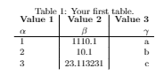
上面表格中间列的数字没有按照小数点对齐，导致表格可读性和美观性较低。幸运地，我们没有必要手动添加一些空格来实现对齐，而是使用`siunitx`包来实现。

### 2. 根据小数点对齐数字
我们需要做的第一件事就是在序言中导入`siunitx`包，并使用`\sisetup`命令来告诉包它需要展示多少个数字位：
```latex
%...
\usepackage{siunitx} % required for alignment
\sisetup{
    round-mode      = places, % rounds numbers
    round-precision = 2, % to 2 places
}

\begin{document}
%...
```
之后，我们可以在我们的表格中应用一种新的对齐设置。因此，除了左对齐（`l`），居中（`c`）和右对齐（`r`），还有一个新的对齐方式`S`，它将使我们之前的表格中地数字自动对齐。在我们之前地表格中，中间列数字有对齐问题，因此我现在把中间数字地对齐方式由（`c`）改成（`S`）：
```latex
\documentclass{article}
\usepackage{siunitx} % required for alignment
\sisetup{
    round-mode      = places, % rounds numbers
    round-precision = 2, % to 2 places
}

\begin{document}

\begin{table}[h!]
    \begin{center}
        \caption{Table with aligned units.}
        \label{tab:table1}
        \begin{tabular}{l|S|r} % c -> S
            \textbf{Value 1} & \textbf{Value 2} & \textbf{Value 3} \\
            $\alpha$ & $\beta$ & $\gamma$ \\
            \hline
            1 & 1110.1 & a\\
            2 & 10.1 & b\\
            3 & 23.113231 & c\\
        \end{tabular}
    \end{center}
\end{table}

\end{document}
```
结果如下：
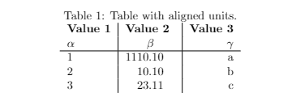

### 3. 添加行和列
既然我们已经建立一个合适的表格，我们可以关注于添加更多的行或列。正如我在上面提到的，LaTeX使用列分隔符`(&)`和行分隔符`(\\)`来格式化输出表格的单元格。对于上述展示的5$\times$3的表格，我们可以数出在每行有一个`(\\)`和2个`(&)`,共5个`(\\)`和10个`(&)`。
如果我们想要添加一个新的行，我们可以简单地复制已有的一行并粘贴，然后更改内容。我将再次使用上面的表格作为本次添加新行的示例：
```latex
%...
\begin{table}[h!]
    \begin{center}
        \caption{Table with aligned units.}
        \label{tab:table1}
        \begin{tabular}{l|S|r} % c -> S
            \textbf{Value 1} & \textbf{Value 2} & \textbf{Value 3} \\
            $\alpha$ & $\beta$ & $\gamma$ \\
            \hline
            1 & 1110.1 & a\\
            2 & 10.1 & b\\
            3 & 23.113231 & c\\
            4 & 23.113231 & d\\  % 新增的行
        \end{tabular}
    \end{center}
\end{table}

%...
```
结果如下：
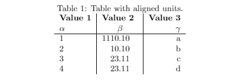
类似地，可以添加新的列，但是你必须小心，因为你需要在每一行添加一个列分隔符`(&)`:
```latex
\begin{table}[h!]
    \begin{center}
        \caption{Table with aligned units.}
        \label{tab:table1}
        \begin{tabular}{l|S|r|r} % c -> S
            \textbf{Value 1} & \textbf{Value 2} & \textbf{Value 3} & \textbf{Value4}\\
            $\alpha$ & $\beta$ & $\gamma$ & $\delta$\\
            \hline
            1 & 1110.1 & a & e\\
            2 & 10.1 & b & f\\
            3 & 23.113231 & c & g\\
        \end{tabular}
    \end{center}
\end{table}
```
结果如下：
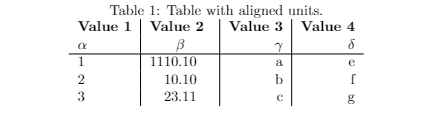

### 4. 跨多行多列的单元格
有时我们需要生成一个跨多个单元格的行，对此我们可以使用`multirow`包，因此首先我们需要把在序言中导入这个包：
```latex
%...
\usepackage{multirow}
\begin{document}
%...
```
现在，我们可以使用`multirow`和`multicolumn`环境来方便地扩展多行或多列。
#### 4.1 使用multirow
为了使一个单元格跨多行，我们需要使用`multirow`命令，其接收三个参数：
```latex
    \multirow{NUMBER_OF_ROWS}{WIDTH}{CONTENT}
```
我通常使用星号`*`作为宽度`WIDTH`的参数，因为这基本上意味着自动确定宽度。
因为我们在示例中合并了两行，所以有必要在下一行中省略同一行的内容。让我们看看实际的LaTeX代码使怎样的：
```latex
\documentclass{article}
\usepackage{multirow}
\usepackage{siunitx} % required for alignment
\sisetup{
    round-mode      = places, % rounds numbers
    round-precision = 2, % to 2 places
}

\begin{document}

\begin{table}[h!]
    \begin{center}
        \caption{Multirow table.}
        \label{tab:table1}
        \begin{tabular}{l|S|r} % c -> S
            \textbf{Value 1} & \textbf{Value 2} & \textbf{Value 3} \\
            $\alpha$ & $\beta$ & $\gamma$ \\
            \hline
            \multirow{2}{*}{12} & 1110.1 & a\\
            & 10.1 & b\\
            \hline
            3 & 23.113231 & c\\
            4 & 23.113231 & d\\
        \end{tabular}
    \end{center}
\end{table}

\end{document}
```
可以看到，包含12的单元格跨了2行。
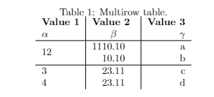

#### 4.2 使用multicolumn
如果希望单元格跨多列，我们需要使用`multicolumn`命令，其使用与`multirow`命令有些区别，因为我们还需要设置新的列的对齐方式。这个命令同样需要三个参数：
```latex
    \multicolumn{NUMBER_OF_COLUMNS}{ALIGNMENT}{CONTENT}
```
在我们的示例中，我们同样将合并两个相邻的单元格。请注意，在我们使用`multicolumn`命令跨多列所在的行中，只有一个列分隔符`&`，而不是两个：
```latex
\documentclass{article}
\usepackage{multirow}
\usepackage{siunitx} % required for alignment
\sisetup{
    round-mode      = places, % rounds numbers
    round-precision = 2, % to 2 places
}

\begin{document}

\begin{table}[h!]
    \begin{center}
        \caption{Multicolumn table.}
        \label{tab:table1}
        \begin{tabular}{l|S|r} % c -> S
            \textbf{Value 1} & \textbf{Value 2} & \textbf{Value 3} \\
            $\alpha$ & $\beta$ & $\gamma$ \\
            \hline
            \multicolumn{2}{c|}{12} & a\\
            \hline
            2 & 10.1 & b\\
            3 & 23.113231 & c\\
            4 & 23.113231 & d\\
        \end{tabular}
    \end{center}
\end{table}

\end{document}
```
结果如下：
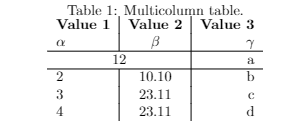

#### 4.3 综合使用multirow和multicolumn
当然，也可以将这两个功能结合起来，制作一个跨越多行多列的单元格。为此，我们只需要使用`multicolumn`命令，并用命令`multirow`作为参数`CONTENT`内容，然后我们必须为合并的行添加另一个多列语句。
因为这个有点难解释，直接看代码更容易理解。在下面的示例中，我们将合并2行2列，所以我们将得到一个跨越总共4个单元格的单元格：
```latex
\documentclass{article}
\usepackage{multirow}
\usepackage{siunitx} % required for alignment
\sisetup{
    round-mode      = places, % rounds numbers
    round-precision = 2, % to 2 places
}

\begin{document}

\begin{table}[h!]
    \begin{center}
        \caption{Multicolumn and -column table.}
        \label{tab:table1}
        \begin{tabular}{l|S|r} 
            \textbf{Value 1} & \textbf{Value 2} & \textbf{Value 3} \\
            $\alpha$ & $\beta$ & $\gamma$ \\
            \hline
            \multicolumn{2}{c|}{\multirow{2}{*}{1234}} & a\\ % 2 行 2 列单元格，填充1234
            \multicolumn{2}{c|}{} & b \\ % 1行2列单元格，填充 空值
            \hline
            3 & 23.113231 & c\\
            4 & 23.113231 & d\\
        \end{tabular}
    \end{center}
\end{table}

\end{document}
```
结果如下：
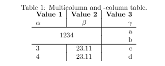

### 5. 使用booktabs美化表格
当然，在旁观者眼中上述表格已经美观了，但我个人认为`table`环境默认的水平分隔线`\hline`不是很漂亮。对于我的表格，我总是使用`booktabs`包，它可以提供更美观的水平分隔线而且使用简单。
```latex
%...
\usepackage{booktabs}

\begin{document}
...
%...
```
现在我们把上面示例代码中的`\hline`替换成`booktabs`包提供的`\toprule`、`midrule`和`\bottomrule`命令：
```latex
\documentclass{article}
\usepackage{booktabs}
\usepackage{siunitx} % required for alignment
\sisetup{
    round-mode      = places, % rounds numbers
    round-precision = 2, % to 2 places
}

\begin{document}

\begin{table}[h!]
    \begin{center}
        \caption{Table with aligned units.}
        \label{tab:table1}
        \begin{tabular}{l|S|r} % c -> S
            \textbf{Value 1} & \textbf{Value 2} & \textbf{Value 3} \\
            $\alpha$ & $\beta$ & $\gamma$ \\
            \midrule
            1 & 1110.1 & a\\
            2 & 10.1 & b\\
            3 & 23.113231 & c\\
            \bottomrule
        \end{tabular}
    \end{center}
\end{table}

\end{document}
```
结果如下：
\hline:

\booktabs packages:
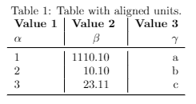

### 6. 跨多页的表格
如果你的表格有许多行，你会看到默认情况下，表格会在页面底部被裁剪，而这肯定不是你想要的。`longtable`包提供了一种可以使表格跨越多页的方便方法。当然，我们必须先将它添加到我们的序言中，然后才能开始使用它：
```latex
%...
\usepackage{longtable}
\begin{document}
...
%...
```
实际上，相比于之前的示例代码，使用`longtable`包生成表格更简单。我将首先展示代码，然后解释`longtable`和`tabular`之间的差别。
```latex
\documentclass{article}
\usepackage{longtable}
\usepackage{booktabs}
\usepackage{siunitx} % required for alignment
\sisetup{
    round-mode      = places, % rounds numbers
    round-precision = 2, % to 2 places
}

\begin{document}
    \begin{longtable}[c]{l|S|r} % 替换 \begin{table}，对齐方式也必须在这里确定(下面不使用tabular了)
        \caption{Multipage table.}
        \label{tab:table1}
        \toprule
        \textbf{Value 1} & \textbf{Value 2} & \textbf{Value 3} \\
        $\alpha$ & $\beta$ & $\gamma$ \\
        \midrule
        \endfirsthaed % 这句表明 表头在这里结束，只会在第一页显示
        \toprule
        \textbf{Value 1} & \textbf{Value 2} & \textbf{Value 3} \\
        $\alpha$ & $\beta$ & $\gamma$ \\
        \midrule
        \endhead % 在\endfirsthead 和 \endhead之间的所有东西将会在每一页显示成 表头

        1 & 1110.1 & a\\
        2 & 10.1 & b\\
        % ...
        % ...
        % ...
        3 & 23.113231 & c\\
        \bottomrule
    \end{longtable}
    
\end{document}
```
在上面的例子中，我们使用的都是`table`和`tabular`环境，`longtable`环境替换了上述两个环境，或者更确切地说将它们组合成一个环境。现在我们使用`\begin{longtable}[POSITION_ON_PAGE]{ALIGNMENT}`作为我们表格地环境。使用这个环境，当我们创建有很多行地表格时，它会自动在页面之间拆分。
结果示例如下：
第一页表格：
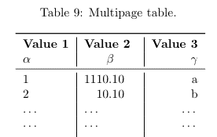
下一页续表：
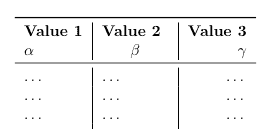

续表会有表头，但是没有表名(caption)。这是因为我已经使用了命令`\endfirsthead`和`\endhead`，在`\endfirsthead`之前的所有内容声明该表所在第一页的标题，而`\endfirsthead`和`\endhead`之间所有的内容都表示标题，会在接下来的每一页重复。**如果您不想在接下来的页面上出现标题，可以删除`\endfirsthead`和`\endhead`之间的所有内容，包括`\endhead`命令。**

### 7. 横向/侧向表格
现在我们有太多行的表格的解决方案，如果我们有太多列的话我们也可能面临同样的问题。如果我们添加了太多列，我们可能得到一个对于页面来说过宽的表格。在这种情况下，通常最好的解决方式时简单地旋转表格并横向打印。虽然有很多旋转表格的方式，但我发现唯一令人满意的方法时使用`rotating`包。
首先我们在序言里添加这个包：
```latex
%...
\usepackage{rotating} % 表格横向放置
\begin{document}
%...
```
这个包提供了简单易用的`sidewaystable`环境，我们只需将`table`环境替换为`sidewaystable`环境：
```latex
\documentclass{article}
\usepackage{rotating}
\usepackage{booktabs}

\begin{document}
    \begin{sidewaystable}[h!] % <--
    \begin{center}
    \caption{Landscape table.}
    \label{tab:table1}
        \begin{tabular}{l|c|r}
            \toprule
            \textbf{Value 1} & \textbf{Value 2} & \textbf{Value 3}\\
            $\alpha$ & $\beta$ & $\gamma$ \\
        \midrule
        1 & 1110.1 & a\\
        2 & 10.1 & b\\
        3 & 23.113231 & c\\
        \bottomrule
        \end{tabular}
    \end{center}
  \end{sidewaystable}
\end{document}
```
结果如下：
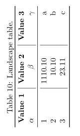

### 8. 从Excel(.csv)导入表格至LaTeX
正如本教程所说，手动编写表格有两个缺点。虽然上述方法适用于与我们例子中相似的小表格，但手动输入大量数据可能需要很长时间。大多数情况下，数据将以电子表格的形式收集，我们不想输入两次数据。此外，一旦放入LaTeX表格中，数据就不能用于绘图了，通常来说不是有用的格式。因此，下一课将向您展示如何从.csv文件（可以从Excel和其他工具导出）自动生成表格。

### 9. 总结
- LaTeX提供了`table`和`tabular`环境用于创建表格
- `table`环境就像表格的包装器(`wrapper`)，类似于`figure`环境
- 对齐和垂直分隔符作为参数传递给`tabular`环境（例如：`\begin{tabular}{l|c|r}`）
- 可以将内容左对齐(`l`)，居中(`c`)和右对齐(`r`)，其中对其运算符的数量需与表格列数匹配
- 可以在对齐分隔符之间添加`|`来分隔列
- 可以使用`\hline`命令分隔行，`&`符号分隔列
- 换行符`\\`表示一行的结束
- 使用`\ref`和`\label`来引用表格
- 使用`siunitx`包在小数点对齐数字
- 使用`multirow`包生成跨多行或多列的表格
- 使用`booktabs`包美化表格
- 使用`longtable`包让表格跨页
- 使用`rotating`包使表格横向展示