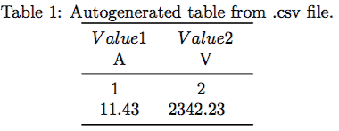

# <center>使用pgfplotstable从csv文件导入表格</center>


使用`pgfplotstable`包从.csv文件中自动读取表格并添加到文档中。

[TOC]

### 1. pgfplotstable的语法和使用
在写文章时，有时会需要在表格中展示大量的数据，手动在LaTeX中编写这样的表格是十分耗时且易错的工作。为了避免这个问题，我们可以简单地从.csv文件中直接导入数据。Excel、OpenOffice Calc甚至emacs org-mode等程序都可以将数据表导出成.csv文件。LaTeX不能直接使用它们，但我们可以使用下列代码从.csv文件中生成表格：
```latex
\documentclass{article}

\usepackage{booktabs} % For \toprule, \midrule and \bottomrule
\usepackage{siunitx} % Formats the units and values
\usepackage{pgfplotstable} % Generates table from .csv

% Setup siunitx:
\sisetup{
  round-mode          = places, % Rounds numbers
  round-precision     = 2, % to 2 places
}

\begin{document}

\begin{table}[h!]
  \begin{center}
    \caption{Autogenerated table from .csv file.}
    \label{table1}
    \pgfplotstabletypeset[
      multicolumn names, % allows to have multicolumn names
      col sep=comma, % the seperator in our .csv file
      display columns/0/.style={
        column name=$Value 1$, % name of first column
        column type={S},string type},  % use siunitx for formatting
      display columns/1/.style={
        column name=$Value 2$,
        column type={S},string type},
      every head row/.style={
        before row={\toprule}, % have a rule at top
        after row={
            \si{\ampere} & \si{\volt}\\ % the units seperated by &
            \midrule} % rule under units
            },
        every last row/.style={after row=\bottomrule}, % rule at bottom
    ]{table.csv} % filename/path to file
  \end{center}
\end{table}

\end{document}
```
结果如下：


对于包含一个表格来说这是一个相当长的代码段，但是不必担心，我们可以重复使用这段代码并且不需要每一次重新写。我们只需要改变这个部分：
```latex
...
 display columns/0/.style={
        column name=$Value 1$,
        column type={S},string type},
      display columns/1/.style={
        column name=$Value 2$,
        column type={S},string type},
      every head row/.style={
        before row={\toprule},
        after row={
            \si{\ampere} & \si{\volt}\\
            \midrule}
            },
        every last row/.style={after row=\bottomrule},
    ]{table.csv} % filename/path to file
...
```

### 2. 添加新的列
控制表格列明和格式化的部分是：
```latex
...
      display columns/1/.style={
        column name=$Value 2$,
        column type={S},string type},
...
```
`columns/NUM/`让我们选择特定列的名称。**注意：序号以0为开头**。为了添加新的列，可以简单地复制整段然后改变序号：
```latex
...
      display columns/2/.style={
        column name=$Value 3$,
        column type={S},string type},
...
```
列的**单位**表示在这部分：
```latex
...
        after row={
            \si{\ampere} & \si{\volt}\\
            \midrule}
            },
...
```
我们只需要添加一个新的`&`符号，并且使用`siunitx`包来为新列添加单位：
```latex
...
        after row={
            \si{\ampere} & \si{\volt} & \si{\tesla}\\
            \midrule}
            },
...
```
为了保证上述代码有效，我们必须确保我们以正确的格式输出.csv，它必须以英文逗号`,`作为列分隔符，换行符作为行分隔符。我们也可以在代码中改变对应的分隔符已适用于其他文件，但是我推荐使用这个模板来避免问题。示例.csv文件如下：

### 3. .csv文件内容示例
```
column 1, column 2
1,2
11.432,2342.23123123
```
正如你所看到的，.csv文件中的数字比表格中显示的数字长，这是因为在文档开头有：
```
\sisetup{
  round-mode          = places, % Rounds numbers
  round-precision     = 2, % to 2 places
}
```
改变上述值将会自动格式化表格所有数字。

### 4. 总结
- LaTeX能从.csv文件中生成表格
- 复制`display column`语句并更改数字和名称可以添加新列
- 使用`\siunitx`命令和`&`符号添加新的单位
- 确保.csv文件以逗号作为列分隔符，换行符作为行分隔符
- 只适用于小于1页的表格