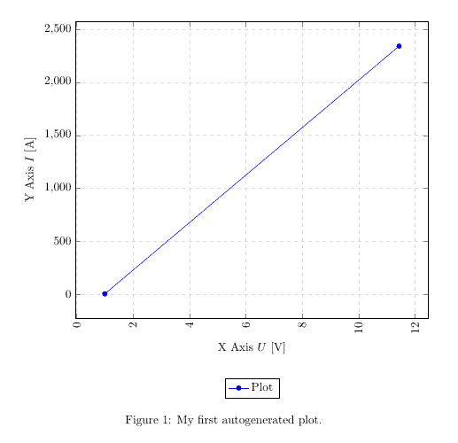

# <center>使用pgfplots可视化数据</center>


`tikz/pgf`中的`pgfplots`包让你在LaTeX中直接从.csv文件中可视化数据

[TOC]

使用`pgfplots`包可以很容易地自动化生成绘图可视化你的数据。强烈推荐阅读课程10地内容，因为我将省略一些基本的关于.csv文件的声明并在本篇中使用该文件进行绘图。

### 1. 基本的绘图
为了绘图，我们将使用下面的代码：
```latex
\documentclass{article}

\usepackage{siunitx}
\usepackage{tikz} % To generate the plot from csv
\usepackage{pgfplots}

\pgfplotsset{compat=newest} % Allows to place the legend below plot
\usepgfplotslibrary{units} % Allows to enter the units nicely

\sisetup{
  round-mode          = places,
  round-precision     = 2,
}

\begin{document}

\begin{figure}[h!]
  \begin{center}
    \begin{tikzpicture}
      \begin{axis}[
          width=\linewidth, % Scale the plot to \linewidth
          grid=major, % Display a grid
          grid style={dashed,gray!30}, % Set the style
          xlabel=X Axis $U$, % Set the labels
          ylabel=Y Axis $I$,
          x unit=\si{\volt}, % Set the respective units
          y unit=\si{\ampere},
          legend style={at={(0.5,-0.2)},anchor=north}, % Put the legend below the plot
          x tick label style={rotate=90,anchor=east} % Display labels sideways
        ]
        \addplot 
        % add a plot from table; you select the columns by using the actual name in
        % the .csv file (on top)
        table[x=column 1,y=column 2,col sep=comma] {table.csv}; 
        \legend{Plot}
      \end{axis}
    \end{tikzpicture}
    \caption{My first autogenerated plot.}
  \end{center}
\end{figure}

\end{document}
```
结果如下：



### 2. 包和设置
我们添加了新的包，代买如下：
```latex
...
\usepackage{tikz}
\usepackage{pgfplots}
...
\pgfplotsset{compat=newest}
\usepgfplotslibrary{units}
...
\begin{figure}[h!]
    \begin{center}
        \begin{axis}[
                width=\linewidth,
                grid=major,
                grid style={dashed,gray!30},
                xlabel=X Aixs $U$,
                ylabel=Y Axis $I$,
                x unit=\si{\volt},
                y unit=\si{\ampere},
                legend style={at={(0.5,-0.2)},anchor=north},
                x tick label style={rotation=90,anchor=east}
            ]
            \addplot
            table[x=column 1,y=column 2,col sep=comma]{table.csv};
            \legend{Plot}
        \end{axis}
    \end{tikzpicture}
    \caption{My first autogenerated plot.}

    \end{center}
\end{figure}
...
```
第一部分只导入必要的包，第二部分也只有两句命令，其中`\pgfplotsset{compat=newest}`禁用了`pgfplots`的向后兼容性，因此我们可以将图的图例放在绘图的下方，`\usepgfplotslibrary{units}`添加了两个新的命令(x和y轴单位)，从而实现良好的括号中变量的单位的格式设置。其他大多数部分语句都是可以自我解释的。其他变量有宽度`width`，x和y轴坐标标签等。你可以将它们注释掉并自行探索。
最重要的部分是：
```latex
...
        table[x=column 1,y=column 2,col sep=comma]{table.csv};
...
```
假设有一个包含如下内容的.csv文件：
```
column 1,column 2
1,2
11.432,2342.23123123
```
我们需要把文件中其中一列的列名作为x轴，在示例中为`x=column 1`，然后另一列作为y轴，由于这里只有两列，因此我们选择`y=column 2`。同样地，`col sep=comma`表明使用逗号作为列分隔符。我们可以复制上述整个代码段并一遍又一遍地使用它，只需要更改要绘制的列和文件名。有很多选项可以设置图形样式和条形图等。我将在后面的教程中展示更多样式，或者在Misc部分添加片段概述。

### 3. 总结
- 使用`pgfplots`可以容易地从.csv文件中获取数据并直接在LaTeX中绘图
- 使用`table[x=column 1,y=column 2...]`从.csv文件中选择列名作为参数输入
