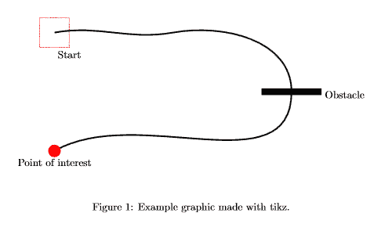

# <center>使用tikz/pgf在LaTeX中绘图</center>


`tikz/pgf`包允许您从LaTeX文档中绘制图片，以保持整个文档地风格一致。

---

[TOC]

`pgf/tikz`包可以用来创建漂亮地图，特别是LaTeX中的图表。它能让你从文档中创建矢量图形，无需使用Inkscape或者Adobe Illustrator等外部工具，因此更加灵活。但与图形编辑器不同的是，我们实际上并不绘制，而是使用预定义的宏对矢量图形进行编程。我将首先展示一个使用基本几何元素的小例子，然后解释tikz的语法。

### 1. 基本例子
```latex
\documentclass{article}

\usepackage{tikz}

\begin{document}
\begin{figure}[h!]
  \begin{center}
    \begin{tikzpicture}
      \draw [red,dashed] (-2.5,2.5) rectangle (-1.5,1.5) node [black,below] {Start}; % Draws a rectangle
      \draw [thick] (-2,2) % Draws a line
      to [out=10,in=190] (2,2)
      to [out=10,in=90] (6,0) 
      to [out=-90,in=30] (-2,-2);    
      \draw [fill] (5,0.1) rectangle (7,-0.1) node [black,right] {Obstacle}; % Draws another rectangle
      \draw [red,fill] (-2,-2) circle [radius=0.2] node [black,below=4] {Point of interest}; % Draws a circle
    \end{tikzpicture}
    \caption{Example graphic made with tikz.}
  \end{center}
\end{figure}
\end{document}
```
结果如下：

我们通常将我们的`tikzpicture`嵌入到`figure`环境中，通过使用`\draw`命令来添加图形元素。定义方括号中参数和元素坐标是必要的。

### 2. tikz语法
为了展示基本的语法，我们仔细看看绘制红色矩形框的语句：
```latex
    \draw [red,dashed] (-2.5,2.5) rectangle (-1.5,1.5) node [black,below] {Start}; % Draws a rectangle
```
这里的参数表示矩形框是红色且虚线，然后定义矩形在笛卡尔坐标系中的位置(-2.5,2.5)。为了设置矩形的大小，我们简单地在声明的矩形后边添加第二对坐标(-1.5,1.5)。正如你所看见的，在矩形下边还有一串文本，该文本通常作为节点（text-node）放置在图片中。我们定义该文本具有黑色，并设置位置位于矩形下方。Tikz通常可以自动地计算出矩形大小。除了在普通LaTeX中，**我们必须在`tikzpicture`环境中以分号终止每个命令。**

下一个代码段显示了如何通过在Tikz中指定路径来绘制一条线：
```latex
    \draw [thick] (-2,2) % Draws a line
        to [out=10,in=190] (2,2)
        to [out=10,in=90] (6,0) 
        to [out=-90,in=30] (-2,-2);
```


### 3. 总结